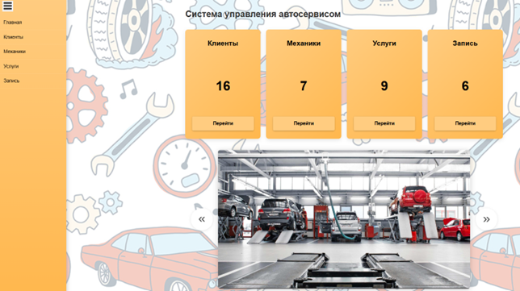
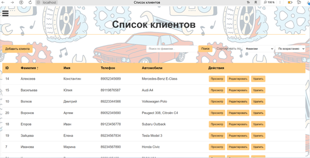
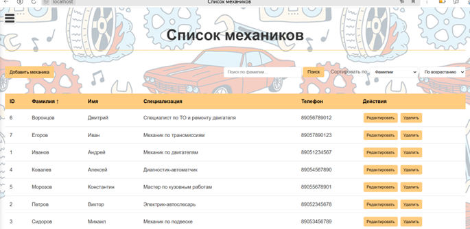
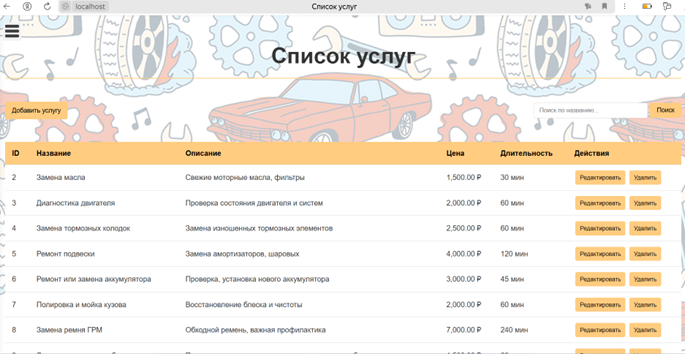
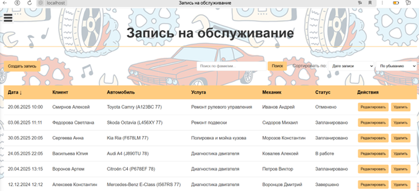
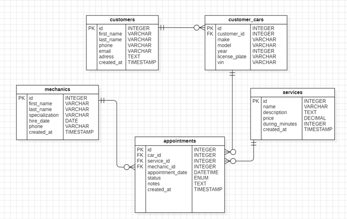

# 🚗 Система управления автосервисом

Задание по летней практике, представляющее собой Web-приложение с базой данных 
*(Административный интерфейс с CRUD-функционалом)*

## 🌟 Возможности
- **CRUD операции** для всех сущностей:
  - 📋 **Управление клиентами** (данные + автомобили)
  - 🔧 **Учет механиков** (данные о работниках)
  - 💰 **Каталог услуг** (цены, описание)
  - 📅 **Система записи** на прием
- 📊 **Визуализация данных** в таблицах и взаимодействие с бд в реальном времени

  
 ## 🛠 Стек
- **PHP**
- **MySQL**
- **HTML/CSS/JS**

## 📸 Скриншоты интерфейса
| Раздел | Скриншот |
|--------|----------|
| **Главная** |  |
| **Клиенты** |  |
| **Механики** |  |
| **Услуги** |  |
| **Записи** |  |

### Моя БД:

